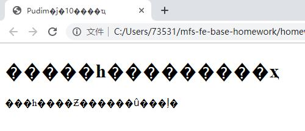
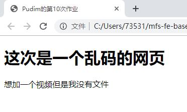
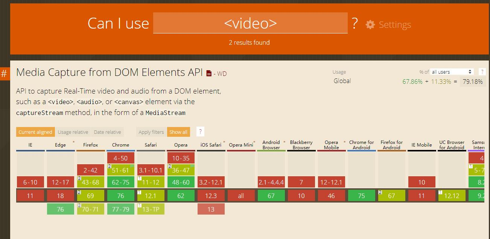

### 简答题
1. HTML5引入了哪些新标签？
    * 用于绘画的canvas元素和可伸缩矢量图形SVG
    * 用于媒介回访的video和audio元素
    * 新的特殊内容元素，比如article,footer,header,nav,section
    * 新的表单控件，比如calendar,date,time,email,url,search等
2. Canvas是什么？它能干什么？
    * 使用js在网页上绘画图像，画布是一个矩形区域，可以控制每一个像素；拥有多种绘制路径，矩形，圆形，字符以及添加图像的方法。
3. SVG 是什么？它能干什么？它和 Canvas 有什么区别？
    * SVG指可伸缩矢量图形
    * SVG用于定义用于网络的基于矢量的图形
    * SVG是可伸缩的
    * SVG使用XML格式定义图形
    * SVG图像在放大或者改变尺寸的情况下其图形的质量不会有损失
    * SVG是万维网联盟的标准
##### SVG具有如下优势

    * SVG图像可通过文本编辑来创建和修改
    * 可以被搜索、索引、脚本化和压缩
    * 可伸缩的
    * 在任何分辨率下被高质量的打印
    * SVG可在图像质量不下降的情况下被放大

4. 如何在网页上播放视频、音频？
    * 可以使用&lt;video>,&lt;audio>嵌套&lt;source>标签，通过使用src属性，并且合理的设置type如type="video/mp4" type="audio/mp3"来播放
5. HTML5引入了哪些结构性元素？他们各有哪些含义？
    * article,代表文档、页面或应用程序中独立的、完整的、可以独自被外部引用的内容，与上下文不相关的独立内容
    * section,表示页面中的一个内容区块，比如章节，页眉，页脚或页面中的其他部分-<b>不要为没有标题</b>的内容使用section元素
    * nav,表示页面中导航链接的部分，例如：传统导航条,侧边栏导航，页内导航，翻页。
    * aside,表示article元素的内容之外的，与article元素的内容相关的辅助信息，它可以包含与当前页面或主要内容相关的引用，侧边栏，广告，导航条，以及其他类似的<b>有别于主要内容的部分</b>
    * header,表示页面中一个内容区块或整个页面的标题。
    * hgroup,将标题及其子标题进行分组的元素。通常会将h1到h6元素进行分组，譬如一个内容区块的标题及其子标题算一组。
    * footer,整个页面或者页面中一个区块的脚注。一般来说它会包含了创作者的姓名、创作日期以及创作者联系信息。
    * figure表示一段独立的流类容，一般表示文档主体内容的一个独立单元。使用figcaption元素为figure元素添加标题。
6.  如果网页发生乱码，我们应该检查什么？具体该怎么做？
    * 乱码产生的根本原因是已保存的编码格式和浏览器解析时的解码格式不匹配所导致。乱码一般是英文以外的字符才会出现的。因此我们需要检查网页编码格式和浏览器的解析模式（charset中设置的解析模式）是否一致。并改成一致的格式。
    * 检查<!DOCTYPE>是否位于html文档的第一行，处于标签之前
7.  请写出一个包含乱码的网页，并合理设置字符集编码，使得它可以正常显示
    * [Web link](https://github.com/a735315482/mfs-homework/blob/master/homework10.html)
    
    * 调试后
    
8. 在哪里查浏览器对标签或属性的支持程度? 请查询&lt;video>标签的浏览器兼容性，并截图
    * 在caniuse.com里面可以查询
 
