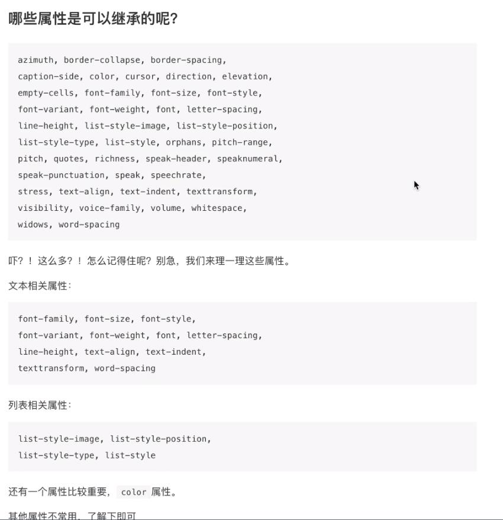
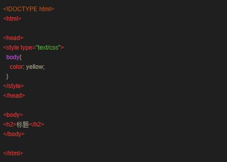
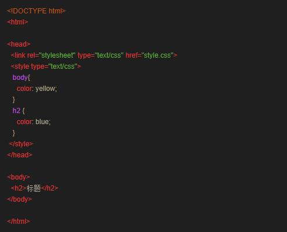
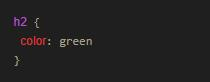

### 简答题
1. 什么是 CSS？它有什么优势？
    * 指层叠样式表，前端三大支柱之一
    * 提高工作效率，便于全局更新，内容与样式相结合
1. 内部样式表和外部样式表各是如何声明和使用？
    * 内部是在head在head中声明style实现。外部是用过link .css文件实现。
1. 多层样式层叠是什么意思？
    * 在一个网页中可能在内部，外部，内联中各自声明了有样式，他们会根据优先级层叠取代，同一个种类的样式只有优先级最高的生效，不同种类的则会层叠。
1. 什么是优先级？样式表的优先级排序是什么？
    * 优先级是在产生层叠取代时判定谁被谁取代的标准，浏览器缺省最低，其次是外部、内部、内联
1. 请解释 CSS 如下概念
    * 选择器：需要应用样式的作用对象
    * 属性： CSS中规定了的属性，通过对属性的设置可以达到控制选择器样式的目的。
    * 值： 属性接受的设置值/关键字，一个属性的值要么是关键字要么是关键字列表。如果一个属性可以取多个关键字，则关键字之间用空格隔开。
    * 声明： 指属性和值之间的半角符号冒号:
    * 声明块: 多个声明之间用分号;来隔开，前后用{}括起来，形成一个声明块。
1. CSS 中回车符(\n)会影响 CSS 的解析吗？请测试在不同位置下的回车符对解析的影响，然后谈谈你的理解
    * 不会，回车只增加代码的数据量，对
1. CSS 代码中如何使用注释？
    * /*   */
1. 浏览器前缀是什么？我们为什么需要浏览器前缀？
    * 类似于-webkit-transform:roate中-webkit-就是属于浏览器前缀，因为CSS标准的发展速度可能比不上CSS技术的发展速度，有一些还没有形成标准的CSS方法各大厂商浏览器为了支持就加上了自己的前缀以便避免被CSS标准检测为非法
1. 对浏览器前缀的处理有哪些方案？其中较好处理方案是哪个？
    * 
1. CSS 缩写是什么？哪些属性支持缩写？
    * 将代码缩写更为易读
    * 包括了对颜色的缩写，对盒子尺寸的缩写，边框缩写，背景缩写，文字缩写，
1. 什么是 CSS 中的继承？哪些属性可以继承？如果不希望子元素继承父元素的某个属性该怎么办？
    * 当一个标签被另一个标签包起来的时候，就会继承，如&lt;div>&lt;span>&lt;/span>&lt;div>，span标签就会继承div中的一些属性
    * 
    * 可以在子元素之间再次编辑属性
1. 以下代码&lt;h2>最终显示成什么颜色？为什么？

    * yellow
    * 这是一个继承关系，h2标签继承了body标签的颜色属性

### 代码题
* 以下代码中&lt;h2>最终显示成什么颜色？如果我想让color: red，在不修改内部和外部样式表的前提下，该如何实现？
    * index.html
    * style.css
* 在继承关系下h2最终会显示成blue，可以&lt;h2 style="color:red">标题&lt;/h2>来实现