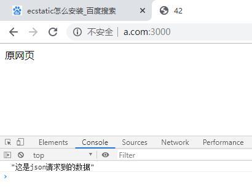
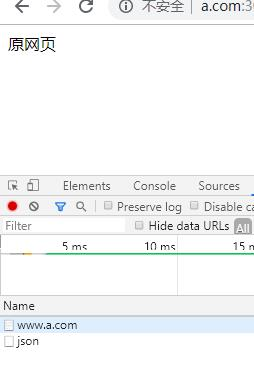

### 问答题
1. AJAX 是什么的简称？它和普通的 HTTP 请求有什么不同？
    * Asynchronous JavaScript and XML
    * AJAX在浏览器与Web服务器之间使用异步数据传输（HTTP请求）从服务器获取数据。这里的异步指的是脱离当前浏览器页面的请求、加载等单独执行，这意味着可以在不重新加载整个网页（普通HTTP需要重新刷新整个页面）的情况下，通过JavaScript发送请求、接受服务器传来的数据，然后操作DOM将数据对网页的某部分进行更新，使用Ajax最直观的感受是向服务器获取数据不需要刷新页面等待了。

1. 传统网页的渲染模式和基于 AJAX 的网页渲染模式有何不同？
    * 传统的渲染方式是返回html
    * AJAX是返回数据，不用刷新整个页面

1. 如何模拟调试 AJAX 的数据
    * 一般使用node.js搭建简易都断来是海鲜Mock数据

1. 如何兼容老浏览器创建 XMLHttpRequest 对象？
    * 通过try  = new XMLHttpRequest(),catch(e)的方式，分别try 1. = new ActiveObject("Msxml2.XMLHTTP"),2. = new ActiveObject("Microsoft.XMLHTTP")。分别尝试3中创建方法。
    * 对于现代浏览器，我们可以直接简化为fuction createXHR(){return new XMLHttpRequest()}

1. XMLHttpRequest 对象有哪几个常用方法？分别对应的含义如何？
    * .open()。在使用XHR对象时要调用的第一个方法是open方法。xhr.open('get', 'default.html', true)
这段代码会针对default.html页面发送get请求，关于这段代码有三点需要注意：
URL是相对于当前页面的路径，也可以使用绝对路径
调用open方法并不会真正的发送请求，而是初始化一个请求准备发送
只能向同一个域中使用相同协议和端口的URL发送请求，否则会因为安全原因报错（同源策略）

    * .send()要想把请求发往服务器需要调用send方法，send方法接受一个参数，参数是请求主体要发送的数据，如果不需要发送数据则传入null，在调用send方法之后请求被发往服务器。

1. 常见的 HTTP 请求头有哪些？如何使用 AJAX 设置 HTTP 请求头？
    * Accept：浏览器能够处理的内容类型；Accept-Charset：浏览器能够处理的字符集；Accept-Encoding：浏览器能够处理的压缩编码；Accept-Language：浏览器当前设置的语言；Connection：浏览器与服务器的连接类型；Cookie：当前页面的cookie；Referer:发送请求的页面的URI。
    * 可以使用setRequestHeader方法设置自定义的请求Header信息，这个方法接受两个参数：头部字段的名称；头部字段的值

1. 如何使用 AJAX 发起 POST 请求
    * 在open方法第一个参数传入”POST”就可以初始化一个POST请求。发送POST请求第二步就是向send方法传输数据参数，参数可以是xml或者字符串，json等。

### 代码题
1. 请使用 AJAX 在自己的网页获取数据，并将数据以你喜欢的方法展现出来（可以渲染 dom，可以打印 console）
可以通过 GET learning-api.mafengshe.com/news 获得数据（后端已经添加跨域返回头），该地址支持如下几个参数

|参数|含义|
|---|---|
|pageSize|默认值 30（最大200），每一页的新闻条目数|
|page|默认 1，请求的页数|

* 
* 