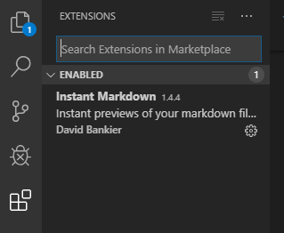
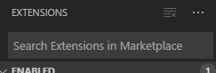

# VsCode常用功能说明
## 1.常用快捷键
* Ctrl+Shift+P,F1 展示全局命令面板

* Ctrl+P 快速打开最近打开的文件

* Ctrl+Shift+N 打开新的编辑器窗口

* Ctrl+Shift+W 关闭编辑器

* Ctrl + X 剪切

* Ctrl + C 复制

* Alt + up/down 移动行上下

* Shift + Alt up/down 在当前行上下复制当前行

* Ctrl + Shift + K 删除行

* Ctrl + Enter 在当前行下插入新的一行

* Ctrl + Shift + Enter 在当前行上插入新的一行

* Ctrl + Shift + | 匹配花括号的闭合处，跳转

* Ctrl + ] 或 [ 行缩进

* Home 光标跳转到行头

* End 光标跳转到行尾

* Ctrl + Home 跳转到页头

* Ctrl + End 跳转到页尾

* Ctrl + up/down 行视图上下偏移

* Alt + PgUp/PgDown 屏视图上下偏移

* Ctrl + Shift + [ 折叠区域代码

* Ctrl + Shift + ] 展开区域代码

* Ctrl + / 添加关闭行注释

* Shift + Alt +A 块区域注释

* Alt + Z 添加关闭词汇包含

**更多快捷键查看详见**[链接](https://baijiahao.baidu.com/s?id=1626592348988752335&wfr=spider&for=pc/"更多快捷方式")

## 2.VsCode中插件的安装与卸载
1. 在VsCode左上角存在如图所示的模块，点击最下方方形图标

方形图标： 

2. 在出现的搜索框中搜索需要安装的插件

3. 点击Install即可实现安装

4. 在已经安装的插件中找到想要卸载的插件，点击Uninstall即可卸载

## 3.在VdCode中使用Git
1. 找到2.1节图片所示位置，点击下图所示图标

2. 点击图标，在左上方对话窗口中输入本次上传的信息名称，点击右侧选项栏，点击Push即完成推送到GitHub服务器

对话框：

选择菜单： 